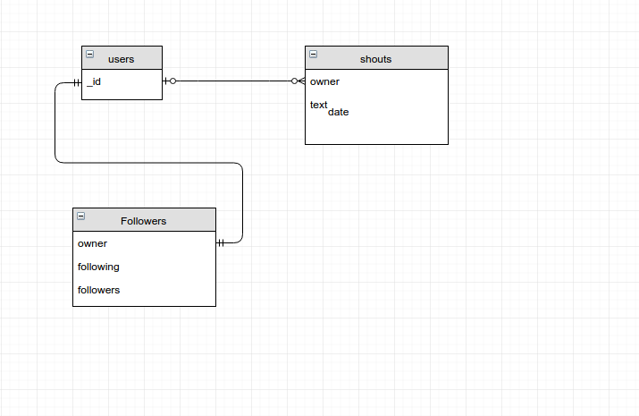

# ShoutBux

A twitter like application that lets you post a “shout”(with a max character limit) to your timeline.

##Requirements

* Node Js => v5.10.0
* npm => 3.10.6
* Meteor Js => 1.4.1.1


##Contents:
* [Installing Meteor](#install)
* [Setting Up](#setup)
* [Running The App](#run)
* [Testing](#test)
* [Diagram](#diagram)
* [Start Page](#start)
* [Notes](#notes)
* [Specification](#specs)
* [Requirements](#reqs)

<a name="install"></a>
### Installing Meteor

On Windows, simply go to https://www.meteor.com/install and use the Windows installer.

On Linux/macOS, use this line:

```bash
curl https://install.meteor.com/ | sh
```
<a name="setup"></a>
### Setting Up

* Clone this repo <https://github.com/evilboss/ShoutBux>
* Make sure you've installed Meteor locally

<a name="run"></a>
### Running The App

Simply install dependencies and start your app with 
```bash 
./start.sh
```
Then you can access the app on <http://localhost:3000>

<a name="test"></a>
### Running Tests

In this app, every part of the client side is fully tested using the familiar tools like Mocha, Chai and Sinon.

Run tests with:


```bash
./test.sh
```

**See package.json for more information about testing setup.**

<a name="diagram"></a>
### High level app design structure diagram
this diagram was made using [https://www.draw.io/] files are in
```bash
cd /diagram && ls
```

shoutbux.xml and shoutbux.png will demonstrate a small highlevel application design structure


<a name="start"></a>
### Start Page
You can now login using these credentials

| username 	| password 	|
|-------------	|:--------:	|
| logan 	| password 	|
| scott 	| password 	|
| cable 	| password 	|
| xavier 	| password 	|
| quicksilver 	| password 	|
| tony 	| password 	|
| steve 	| password 	|
| natasha 	| password 	|
| clint 	| password 	|
| rhodey 	| password 	|

<a name="notes"></a>
### Notes
**NOTE:** If this gives you missing module errors, React requires npm v3. Here's how to install npm3 and get it setup.
> ```bash
> npm install -g npm@3.8.5
> cd ShoutBux-app 
> rm -rf node_modules
> npm install
> meteor
> ```


<a name="specs"></a>
### Specs
* [x] Must be written in NodeJS frameworks (expressJS, meteorJS etc).
* [x] Must have its own Repository(GitHub, BitBucket etc).
* [x] Must have testing.
* [x] Must use Database storage(MySQL, sqLite or *MongoDB* etc).
* [x] A README file that contains the information about the application and the steps on how to run it.
* [ ] Must have a high level app design structure diagram. (Important!)

<a name="reqs"></a>
### Requirements
*  [x] The application should have a simple login feature
  * [x] Must implement correct form handling/validation.
  * [x] Seed the app with atleast 10 users.

* [x] Authorized users can post, edit, delete a “shout” to their own timeline.
  * [x]  A “shout” should contain 32 chars max.
  * [x] Should contain date posted ( momentjs library can be used)
  * [x]  “Shouts” should be sorted by date posted - latest first.
  * [x] Only the owner of the “shout” can alter it.
* [x] Only users that follow the other can see each others timeline.
  * [x] Include this on the seeder where in a user follows other user
* [x] Timelines should update realtime.
  * [x] Whenever User X is looking at User Y’s timeline, every update of Y’s timeline should directly reflect to User X’s view of User Y’s timeline.
* [ ]  Use your imagination for the look and feel of the app.
* [x] Candidate should demonstrate test suite implementations.
